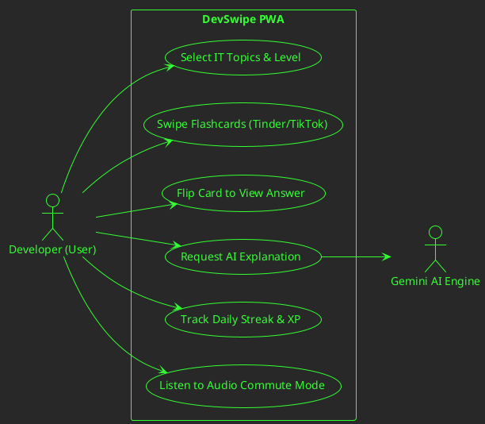
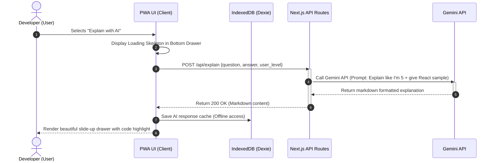

# Software Requirements Specification (SRS): DevSwipe PWA

## 1. Title & Scope Overview

This document defines the user experience, functional requirements, and screen specifications for **DevSwipe**, an addictive, Tinder-and-TikTok-inspired Progressive Web App (PWA) for IT interview preparation.

This specification serves as the official hand-off document for the **UI/UX Designer** to create high-fidelity Figma mockups, interactive prototypes, and micro-interaction states.

---

## 2. Workflows & Visualizations

### 2.1 Use Case Diagram (PlantUML)

Below is the PlantUML Use Case diagram detailing high-level user-centric interactions.



### 2.2 Overview Flow (Mermaid Flowchart)

This flowchart describes the sequential user journey and state branching of the card review feed.

```mermaid
flowchart TD
    Start([Launch DevSwipe PWA]) --> Config{Has Selected Topics?}
    Config -- No --> TopicSelect[Show Onboarding: Choose Topics & Skill Level]
    TopicSelect --> SaveConfig[Save Config to local IndexedDB]
    SaveConfig --> Config

    Config -- Yes --> LoadFeed[Initialize Swipe Feed & Streaks]
    LoadFeed --> CardView[Display Top Card in Stack]

    CardView --> Action{User Action}

    Action -- Double Tap --> FlipCard[3D Flip Card: Reveal Answer & Code]
    FlipCard --> AIHelp[Optional: Click "Explain with AI" -> Slide up AI Drawer]
    AIHelp --> BackToCard[Close Drawer]
    FlipCard --> Action

    Action -- Swipe Left (Review) --> LogFail[Update SRS: Schedule Soon]
    LogFail --> CheckStreak[Verify Daily Streak Status]

    Action -- Swipe Right (Got it) --> LogSuccess[Update SRS: Interval Multiplied]
    LogSuccess --> EarnXP[Award +10 XP]
    EarnXP --> CheckLevelUp{XP Reaches Cap?}
    CheckLevelUp -- Yes --> ShowLevelAnimation[Trigger Confetti & Level Up Badge]
    CheckLevelUp -- No --> CheckStreak
    ShowLevelAnimation --> CheckStreak

    CheckStreak --> NextCard[Load Next Card from Queue]
    NextCard --> CardView
```

### 2.3 Component Interaction (Mermaid Sequence Diagram)

This diagram shows the step-by-step chronological communication between the PWA Client, IndexedDB, the Sync Engine, and the Gemini AI API.



---

## 3. Screen Specifications & UI/UX Guidelines (For Designers)

### 3.1 Design System Foundations

- **Theme:** Sleek Dark Mode (Default). Modern Glassmorphism (semi-transparent card containers with `backdrop-filter: blur()`).
- **Harmonious Color Palette:**
  - **Primary Background:** Deep Space Blue/Indigo (`#0B0D19`)
  - **Card Background:** Translucent Obsidian (`rgba(22, 28, 45, 0.7)`) with border highlight (`rgba(255, 255, 255, 0.08)`)
  - **Right Swipe (Got it):** Emerald Green (`#10B981`)
  - **Left Swipe (Review):** Sunset Rose/Red (`#F43F5E`)
  - **Streak/XP Accent:** Warm Flame Orange (`#F97316`)
- **Typography:** Modern Sans-Serif (e.g., _Outfit_ or _Inter_). Monospace font (e.g., _Fira Code_) for code blocks.

### 3.2 Core Screens & UI Components

| Screen Name                         | Description                                                   | Key UI Elements & Visual Hierarchy                                                                                                                                                                                                                                                                                                                                                                                                                                                                                               |
| :---------------------------------- | :------------------------------------------------------------ | :------------------------------------------------------------------------------------------------------------------------------------------------------------------------------------------------------------------------------------------------------------------------------------------------------------------------------------------------------------------------------------------------------------------------------------------------------------------------------------------------------------------------------- |
| **1. Onboarding & Selection**       | Initial screen for first-time use or configuration.           | • Grids of IT topics (Frontend, Backend, System Design, DevOps, SQL, DSA).<br>• Selector for Career Level (Junior, Mid, Senior, Tech Lead).<br>• Call-to-Action "Start Swiping" button with pulsing gradient outline.                                                                                                                                                                                                                                                                                                            |
| **2. Swipe Arena (Tinder UX)**      | The core interactive zone where card stacks are manipulated.  | • **Top Header:** Daily streak indicator (flame icon with streak number), XP level bar (e.g., Level 3 - Senior Jr. with percentage fill).<br>• **Card Stack:** 3D overlapping stack. The top card is interactive; behind cards are slightly offset.<br>• **Card Content:** Large centered question, Category tag (e.g., `#react`, `#system-design`), Difficulty tag.<br>• **Bottom Action Bar:** Tap-button alternative for swiping (Red "X" for review, Green Check "✓" for Got it, Blue Star for bookmark, Magic Wand for AI). |
| **3. Answer View (The Flip State)** | Reveals the core technical answer and code.                   | • Triggered by **Double Tap** or **Tap to Flip** button.<br>• Satisfying 3D Y-axis flip animation.<br>• Scrollable text content area.<br>• Syntax-highlighted code block with a one-click "Copy Code" button.                                                                                                                                                                                                                                                                                                                    |
| **4. AI Explanation Drawer**        | Slide-up modal containing customized AI-generated breakdowns. | • Smooth slide-up transition from the bottom viewport.<br>• Toggle tabs: `[Simple Breakdown]`, `[Analogy / ELI5]`, `[Edge Cases]`.<br>• Floating feedback buttons (Thumbs up/down).                                                                                                                                                                                                                                                                                                                                              |
| **5. Hands-free Commute Dashboard** | Minimal interface optimized for audio-only listening.         | • Giant circular Play/Pause button in the center.<br>• Pulsing ambient soundwave/equalizer visualization matching the audio playback state.<br>• Active transcript showing the current question being read aloud by Text-to-Speech (TTS).                                                                                                                                                                                                                                                                                        |

---

## 4. Interaction Design & Micro-Animations

### 4.1 Tinder Gesture Feedback (Horizontal)

1.  **Drag State:** When dragging a card horizontally, rotate the card slightly (up to `15deg` rotation) depending on drag distance.
2.  **Left Drag Visual:** Fade in a semi-transparent red overlay on the card with the text "REVIEW" as it tilts left.
3.  **Right Drag Visual:** Fade in a semi-transparent green overlay with the text "GOT IT" as it tilts right.
4.  **Threshold:** If dragged past `120px` from center and released, trigger swipe-out velocity animation off-screen. If below threshold, snap back to center using smooth spring physics.

### 4.2 TikTok Feed Feedback (Vertical)

1.  When active in "Feed Mode" (user toggled TikTok scroll instead of Tinder stack), card stack converts to a single vertical scroll container with CSS **Scroll Snap** (`scroll-snap-type: y mandatory`).
2.  Users scroll up/down. Double-tap triggers a ripple effect under the finger and flips the active card.

### 4.3 Gamification Visuals

- **XP Earned Event:** Flying text numbers (`+10 XP`) float up from the card and disappear.
- **Streak Increase:** The streak flame icon scales up briefly (`transform: scale(1.3)`) and glows with a neon drop-shadow when a day is marked active.
- **Level Up Event:** Full-screen overlay with canvas confetti, presenting a shining badge of the new level (e.g., "Senior Developer unlocked!").

---

## 5. Technical Requirements for Implementation & SEO

- **PWA Shell:** Standard manifest files, theme-color configured dynamically (`#0B0D19` for dark mode).
- **Touch Targets:** Action buttons on mobile must be minimum `48px` in height and width with proper padding (`12px` minimum spacing) to satisfy accessibility (a11y) standards.
- **Accessibility:** ARIA live regions for Text-To-Speech mode, ensuring screen readers describe the card state changes correctly.
- **Unique IDs:** All major interactive buttons (`btn-swipe-left`, `btn-swipe-right`, `btn-flip`, `btn-ai-explain`, `btn-commute-mode`) must have unique, descriptive IDs for end-to-end automated testing.
